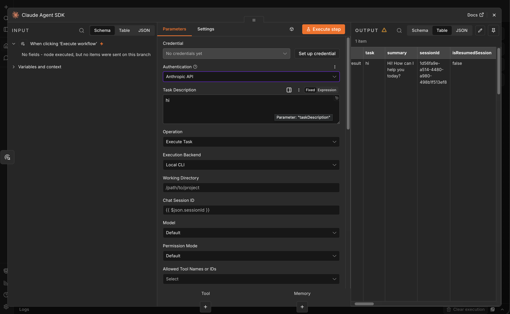

# n8n-nodes-claude-agent-sdk

An n8n community-node package for running Claude Agent SDK / Claude Code tasks
inside self-hosted n8n workflows.

This package targets self-hosted n8n instances where you control the runtime. It
uses host-level capabilities such as child processes, filesystem access,
environment variables, the Claude CLI, webhooks, and optional Redis/Postgres
services. It is not designed as an n8n Cloud-compatible or n8n-verified node.



## Features

- `Claude Agent SDK` node with **Execute Task** and **Generate Python SDK Script**
  operations.
- Local CLI execution with Anthropic API keys or Claude Code CLI subscription
  auth.
- Provider support for Anthropic, OpenRouter, Alibaba Coding Plan, LiteLLM,
  Ollama, and custom Anthropic-compatible endpoints.
- Session memory through Simple, Redis, or Postgres memory nodes.
- Human-in-the-loop approvals/questions through browser/webhook flows and
  channel nodes.
- Optional Postgres-backed HITL interaction, stream replay, and observability
  persistence.
- Secure environment variable injection with exact-value redaction at node
  output and persistence boundaries.
- Sandbox, path sandbox, tool policy, audit logging, MCP servers, structured
  output, subagents, and generated Python SDK script export.

## Documentation

Start with the public usage docs:

- [Docs Index](docs/README.md)
- [Installation](docs/installation.md)
- [Providers And Credentials](docs/providers-and-credentials.md)
- [Execute Task](docs/execute-task.md)
- [HITL](docs/hitl.md)
- [Persistence And Operations](docs/persistence-and-operations.md)
- [Troubleshooting](docs/troubleshooting.md)

## Quick Install

### From GitHub (current distribution)

The package is installed straight from this repository (it is not on the npm
registry yet). Its `prepare` hook builds the node on install, and
`@anthropic-ai/claude-code` is pulled in automatically — no `#branch` suffix
needed:

```bash
mkdir -p ~/.n8n/nodes && cd ~/.n8n/nodes
npm init -y >/dev/null 2>&1   # only if this folder has no package.json yet
npm install git+https://github.com/ivorpad/n8n-nodes-claude-agent-sdk.git
```

Restart n8n afterwards; re-run the `npm install` to update.

> **Prerequisites:** `git` on the host (npm shells out to clone) and **Node.js 20
> or 22** — n8n's supported runtime. (A transitive native dependency,
> `isolated-vm`, does not yet build on Node 26.)
>
> **CodeMie SSO:** also install the companion
> [`n8n-nodes-claude-codemie`](https://github.com/ivorpad/n8n-nodes-claude-codemie)
> the same way — installing it is the feature flag that enables the **CodeMie
> Proxy** authentication option on the node.

### From the n8n editor

Once the package is published to the npm registry, install it from **Settings ->
Community Nodes -> Install a community node** by entering
`n8n-nodes-claude-agent-sdk`. Restart n8n if your deployment requires it.

### From a local tarball

```bash
corepack enable
pnpm install --frozen-lockfile
pnpm run build
pnpm pack
```

Then install the generated `.tgz` in n8n's community-node directory. See
[Installation](docs/installation.md) for more install and verification details.

## Runtime Requirements

For Local CLI execution:

- install this package with npm so `@anthropic-ai/claude-code` is installed
  alongside the community node,
- configure provider credentials or a logged-in CLI session,
- use Postgres Session Memory when queue-mode workers can touch the same
  `chatSessionId`.

## Development

```bash
pnpm install
pnpm run build
pnpm run typecheck
pnpm test
pnpm run lint
```

The package uses `pnpm-lock.yaml` as the authoritative lockfile.

## License

MIT
